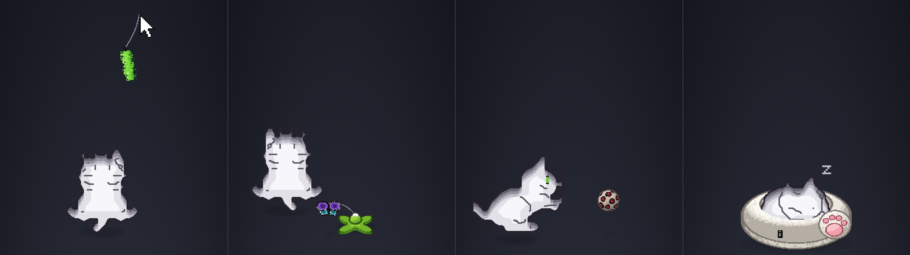
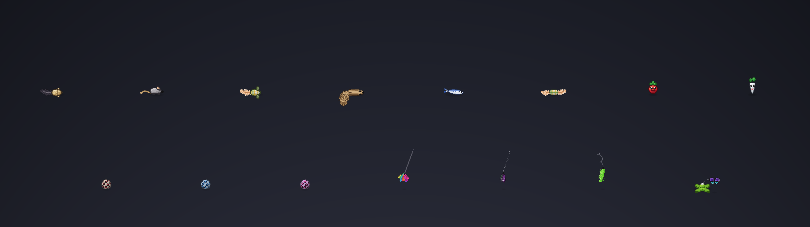

# cece: a Burmilla cat for Omarchy



Cece is a pixel-art cat who lives on your desktop. She chases your mouse
cursor across every monitor. When you leave her alone she washes, yawns and
curls up in one of four beds. After a nap she plays with a new toy every two
minutes: mice, balls, radishes, feather wands and a butterfly spinner. Flick
the mouse and a feather wand dangles from the pointer for her to swat. Start
typing and she hops over to your smallest other screen, out of your way.

She is a Rust port of [crgimenes/neko](https://github.com/crgimenes/neko),
rebuilt for Hyprland and packaged as an [Omarchy](https://omarchy.org)
bar-widget plugin. Cece is a **Burmilla**: silver-white coat, darker tipping
on the back and crown, green eyes lined in black and a brick-pink nose.

## Screenshots

On a 2560×720 panel at scale 2 (a Corsair Xeneon Edge), true to size:

| | |
|---|---|
|  |  |
| Following the pointer | A flick of the mouse: a wand on the pointer |
|  |  |
| Playing: a leopard ball | Playing: the butterfly spinner |
|  |  |
| Playing: a hopping radish | Playing: a sardine |
|  |  |
| Playing: a plush mouse | Playing: a shaggy squirrel |
|  |  |
| Playing: a feather wand | Playing: a straw mouse |
|  |  |
| Asleep on the duck comforter | Asleep in the paw donut |
|  |  |
| Asleep in the cardboard scratcher | Asleep in the basket tree |
|  |  |
| Washing a paw | Every toy |

The pictures are drawn by cece's own renderer; `cargo test --release
screenshots -- --ignored` regenerates them and `preview.png`.

## What changed from neko

| | crgimenes/neko (Go) | cece (Rust) |
|---|---|---|
| Display | Ebitengine window moved around with `SetWindowPosition` (does nothing on Wayland) | `wlr-layer-shell` overlay surface, click-through, above everything |
| Cursor | window-relative cursor | Hyprland IPC `cursorpos`, global across monitors |
| Motion | fixed step every tick; two frames flipped on a timer | eased steering with braking on arrival, legs cycle with the distance covered, a small bounce each stride, 60+ fps on the monitor's refresh clock |
| Idle | awake → scratch → wash → yawn → sleep | the same routine with some randomness, blinking, a head-bob while washing, a startled hop when woken, floating Zzz, clawing at the screen edge when the cursor is out of reach |
| Typing | — | when you type (input without the pointer moving), she hops over to the smallest other monitor and stays out of the way there until you move the mouse |
| Flick | — | move the mouse fast and a feather wand hangs from the pointer on a swinging string for her to chase, until the pointer calms down |
| Beds | — | she naps in a bed that fades in under her: a duck comforter, a fleece donut with a pink paw, a cardboard scratcher bowl or a woven basket on a sisal post, never the same one twice in a row |
| Play | — | after a minute asleep a round of play starts: a toy every two minutes, never the same one twice in a row, for ten minutes, then back to sleep. The toys: straw, plush and plaid mice, a shaggy squirrel, a sardine, a feather candy, two radishes, three leopard balls, three feather wands or a butterfly spinner. Mice scurry like wind-up toys, balls roll, radishes hop, wands are dangled from off screen and the butterfly circles its base; the cat chases them and bats them around until they run down |
| Sprites | 32×32, black and white | 128×128 Burmilla with 2px lines, pixel-exact on a 2× HiDPI screen at the default size (or `--skin classic`), plus a soft shadow |

## Dependencies

All of these come from your distribution; nothing is downloaded at run time.

| Needed for | Packages |
|---|---|
| Running | Omarchy (Quattro) with Hyprland and `omarchy-shell` |
| Building | `rust` (cargo, 1.85 or newer), `pkgconf`, `alsa-lib` (for the sounds) |

`cargo` fetches the Rust crates pinned in `Cargo.lock` from crates.io when it
builds. Cece reads the pointer position from Hyprland's IPC socket and asks
the compositor for idle notifications to tell when you are typing; it never
reads the keyboard itself.

## Install

From the Omarchy plugin marketplace, or by hand:

```bash
omarchy plugin add https://github.com/ure/cece
~/.config/omarchy/plugins/ure.cece/install.sh
```

Or from a clone:

```bash
git clone https://github.com/ure/cece && cd cece
./install.sh
```

`install.sh` builds `cece`, installs it to `~/.local/bin/cece`, puts the bar
widget in `~/.config/omarchy/plugins/ure.cece` (a marketplace checkout already
is that folder) and adds it to the right side of the bar. The cat comes out
straight away.

The bar icon:

- **Click** to mute or unmute the cat. The icon greys out while it is muted.
- **Right click** to make it stay put, or follow again.
- **Middle click** to send it away. Middle click again to let it back out
  with a toy mouse already on its way in.

Sound and whether the cat is out are remembered across shell restarts and
logins. Widget settings (speed, size, skin) live in the `ure.cece` entry of
`~/.config/omarchy/shell.json`, for example:

```json
{ "id": "ure.cece", "speed": 3, "scale": 2.5, "quiet": true, "toy": 120 }
```

`toy` is how many seconds the cat sleeps before a toy mouse gets thrown in
(default 60), or `"off"`. Moving the cursor ends the game.

`./install.sh --no-plugin` installs only the binary.

## Uninstall

```bash
~/.config/omarchy/plugins/ure.cece/install.sh --uninstall  # stop the cat, remove the binary
omarchy plugin remove ure.cece                             # the plugin and its bar icon
rm -rf ~/.config/cece                                      # your config file, if you made one
```

The widget's settings are its own `ure.cece` entry in `shell.json`, which
`omarchy plugin remove` takes along.

## Running it by hand

```bash
cece                 # Burmilla, default speed and size
cece --skin classic  # the original black-and-white neko
cece --speed 3 --scale 1.5 --quiet
cece --toy 5         # a toy mouse after only 5 seconds asleep
cece --play          # come out with a toy mouse straight away
pkill -USR1 -x cece  # toggle stay / follow
pkill -USR2 -x cece  # toggle sound
```

Defaults can also go in `~/.config/cece/config`:

```ini
speed = 2.5
scale = 2
quiet = true
skin = burmilla
toy = 60
```

## Sprites

`sprites/classic/` holds the original 32×32 neko sprites. `tools/burmilla.py`
(needs Pillow) turns them into the sheets under `assets/`:

1. It sorts every pixel into outline, inner line, fur, eye or nose. Eyes and
   nose are found as the small isolated marks inside the face.
2. It scales the pixel classes 4× with Scale2x applied twice, which keeps the
   curves and diagonals smooth. Then it thins the lines again: the outline
   keeps its outer 2px, and inner lines are reduced to a skeleton and redrawn
   at an even 2px.
3. It paints the coat at 128×128 in flat bands, with no dithering. Fur darkens
   the closer it sits to the top edge of the silhouette, which gives the back,
   crown and tail their tipping. Fur far from any edge becomes the pale chest.
   Eyes are green with black lids and a glint.
4. It adds blink frames and writes `assets/burmilla.png` and `assets/classic.png`.

```bash
python3 tools/burmilla.py --preview /tmp/preview.png
cargo build --release
```

A custom skin is any PNG laid out like those sheets: 128×128 frames, eight per
row, in the order listed in `src/sprites.rs`. Load it with `--skin path.png`.

## License

BSD 2-Clause, like neko. The sprites and sounds come from crgimenes/neko,
which in turn inherited them from the classic Neko.
